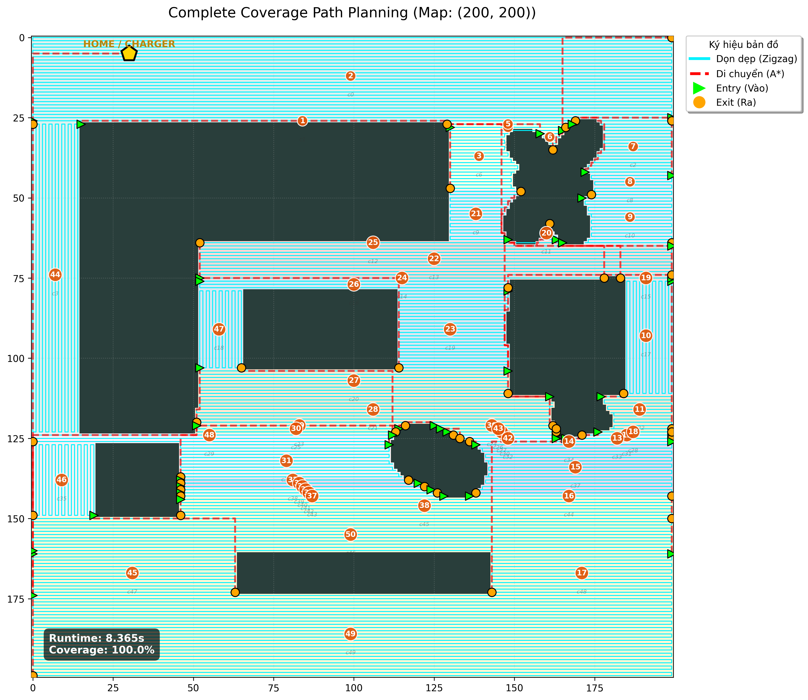

# Coverage-Path-Planning

A high-performance Python pipeline for complete coverage path planning on complex 2D maps (CAD/PNG). This project combines Boustrophedon Cellular Decomposition (BCD) for spatial partitioning and Ant Colony Optimization (ACO) for global route efficiency.

## 🌟 Key Features
- Safety-First BCD: Enhanced decomposition logic that splits cells at critical obstacle boundaries to prevent collisions.
- High Performance: Optimized to run maps up to 200x200 in ~5 seconds.
- Rectilinear Movement: Robot prioritizes 90-degree L-turns for professional, "human-like" cleaning patterns.
- Adaptive Snake Path: Automatically chooses horizontal or vertical zigzagging based on cell geometry.

## 🏗️ System Architecture (Submodules)
The pipeline is organized into modular stages as defined in the following files:

### 1. Pre-processing & Decomposition
- `input_processing.py`: Converts CAD/PNG images into binary Occupancy Grid Maps (OGM). Includes denoising and flood-fill logic to handle closed rooms.
- `cell_decomposition.py`: Implements the BCD algorithm. It partitions the map into simple convex regions (cells) where zigzagging is safe and efficient.
*Note*: Includes a TOLERANCE parameter to handle curved walls.

### 2. Node & Graph Construction
- `node_generation.py`: Extracts geometric metadata (centroids, boundaries) and generates entry/exit candidate points for each cell.
- `reduced_graph.py`: Builds a topological map of the cells and calculates a distance matrix using A* pathfinding between cells.

### 3. Global Optimization
- `aco_mmas.py`: A **MAX-MIN Ant System (MMAS)** implementation. It solves the Traveling Salesman Problem (TSP) variant to find the most efficient order to visit all cells, minimizing travel time between rooms.

### 4. Detailed Path Planning
- `path_planning.py`: The "brain" of the robot's movement.
    - Generates Snake Paths (Zigzags) inside cells.
    - Ensures safe transitions between cells using A*.
    - Implements L-Turn logic for structured movement.

### 5. Orchestration
- `CoveragePipeline.py`: The master script that links all submodules. It handles the data flow from raw image input to the final master path and generates runtime metrics.

## ⚙️ Computational Pipeline

The system follows a sequential multi-stage pipeline:

1. **Map Normalization**: Raw CAD/PNG inputs are filtered and resized into an Occupancy Grid.
2. **Safety BCD**: The grid is decomposed into cells with a `TOLERANCE` check to ensure the robot never "cuts corners" into obstacles.
3. **Graph Construction**: A topological graph is built where nodes are cells and edges are the shortest A* paths between them.
4. **Global Optimization**: ACO-MMAS finds the near-optimal sequence to visit every cell, minimizing "deadheading" (unproductive travel).
5. **Coverage Generation**: Each cell is filled with a snake-path pattern, then linked into a single continuous master trajectory.

## 📂 Project Structure

| File | Description |
| :--- | :--- |
| **`CoveragePipeline.py`** | **Orchestrator**: The master script that connects all modules and runs the full process. |
| **`input_processing.py`** | **Pre-processor**: Converts images/CAD to clean Binary Occupancy Grids (OGM). |
| **`cell_decomposition.py`**| **Spatial Partitioning**: Implements BCD to divide the map into clean, convex cells. |
| **`node_generation.py`** | **Feature Extraction**: Calculates cell centroids and entry/exit candidates. |
| **`reduced_graph.py`** | **Topological Mapping**: Builds a graph of rooms and calculates costs using A*. |
| **`aco_mmas.py`** | **Global Optimizer**: Solves the cell-sequence TSP using Max-Min Ant System. |
| **`path_planning.py`** | **Local Planner**: Generates zigzag cleaning paths and smooth transitions. |

## 🚀 Getting Started
### Prerequisites
- Python 3.8+
- Dependencies:
```bash
pip install numpy matplotlib scipy opencv-python scikit-learn
```

### Running the Pipeline
- Place your map image (e.g., map.png) in the project root.
- Configure the CHARGING_STATION coordinates in CoveragePipeline.py.
- Execute the main script:

```bash
python CoveragePipeline.py
```

## ⚙️ Configuration & Tuning
To balance speed and safety, you can adjust these key parameters:
- Cell Safety (`cell_decomposition.py`): Set `TOLERANCE = 1` for high-sensitivity splitting (safer for complex corners) or `TOLERANCE = 3` for faster performance on curved maps.
- ACO Speed (`aco_mmas.py`): Adjust `num_ants` and `num_iiterations. For maps under 200x200, 20 ants and 100 iterations usually converge in < 2 seconds.
- Visual Aesthetics (`CoveragePipeline.py`): The visualization uses high-contrast circular badges and slate-gray paths for clarity.

## 📊 Performance Metrics
- Runtime Report
```text
           SYSTEM RUNTIME PROFILE            
─────────────────────────────────────────────
🔹 Step 1: Preprocessing        :  1.4633s ( 17.5%)
🔹 Step 2: BCD Decomposition    :  0.0409s (  0.5%)
🔹 StStep 3: Node Generation    :  0.3197s (  3.8%)
🔹 Step 4: Graph Building       :  0.5030s (  6.0%)
🔹 Step 5: Distance Matrix      :  0.0297s (  0.4%)
🔹 Step 6: ACO Pathfinding      :  5.8882s ( 70.4%)
🔹 Step 7: Trajectory Planning  :  0.1204s (  1.4%)
─────────────────────────────────────────────
🚀 TOTAL PIPELINE RUNTIME      :  8.3652s
═════════════════════════════════════════════
```
- Perfomance Report
```text
📊 FINAL PERFORMANCE REPORT
═════════════════════════════════════════════
📍 Coverage Rate:      100.00%
🚀 Total Steps:         29567 steps
🧹 Cleaning Steps:      27859
🔗 Transition Steps:    1708
∟  90° Turns (L-Turn):  753
🔄 180° Turns (U-Turn): 33
📈 Efficiency Ratio:    0.94
═════════════════════════════════════════════
```


